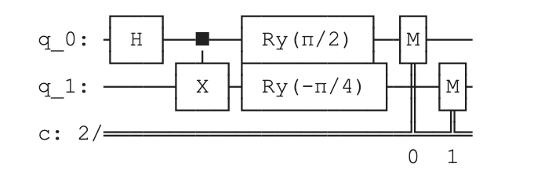

# qiskit-fall-fest-2021
This repository is used for competing in the UT Austin Qiskit Fall fest 2021\
 **Team Members:** Trisha Agrawal, Erika Tan, James Larsen, Jordi Ramos

## Our Project

## Usage Guide

## Qiskit Implementation

We used the Qiskit package to implement the CHSH game protocol. The CHSH game is an well-known non-local game in quantum information. The Qiskit textbook has some information on it but we still had to implement the game using mainly our own code.

This is the CHSH game protocol: Alice does nothing to her qubit if  and she applies a  counterclockwise rotation towards  if . Bob applies a  counterclockwise rotation towards  if  and he applies a  *clockwise* rotation towards  if . Alice and Bob both measure 
their qubits in the  basis and output whatever they see. 
This strategy wins  of the time, 
while any classical strategy can win with probability of at most 

After carefully verifying the algorithm by hand, we decided to implement a function where apply apply a Hadamard gate and a CNOT gate to two qubits so that they are entangled, and we will perform a rotation gate on either of the two qubits based on the inputs.

This is the code we used for implementing the circuit:
```
def make_chsh(x, y):
    """Create quantum circuit for CHSH protocol.
      input -- x: the x input for the CHSH non-local game
               y: the y input for the CHSH non-local game

      output -- qc: CHSH circuit created
    """
    # initialize quantum circuit with 2 qubits and 2 classical bits
    qc = QuantumCircuit(2,2)

    # apply Hadamard gate and control-not
    qc.h(0)
    qc.cx(0, 1)
    
    # apply conditional rotations
    if x == 1:
        qc.ry(np.pi/2, 0)
    if y == 0:
        qc.ry(np.pi/4, 1)
    elif y == 1:
        qc.ry(-np.pi/4, 1)
    qc.measure(range(2),range(2))
    
    return qc
```
This is what the circuit looks like when x = 1 and y = 1 :




## What We Learned